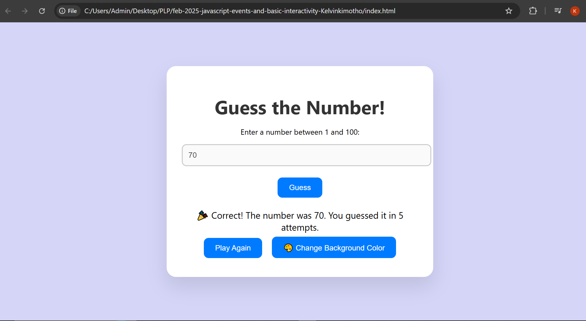
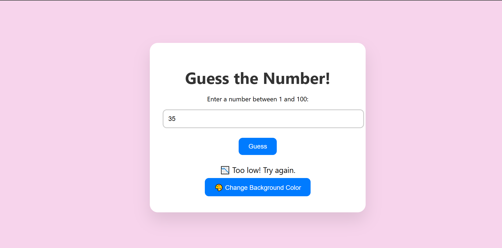
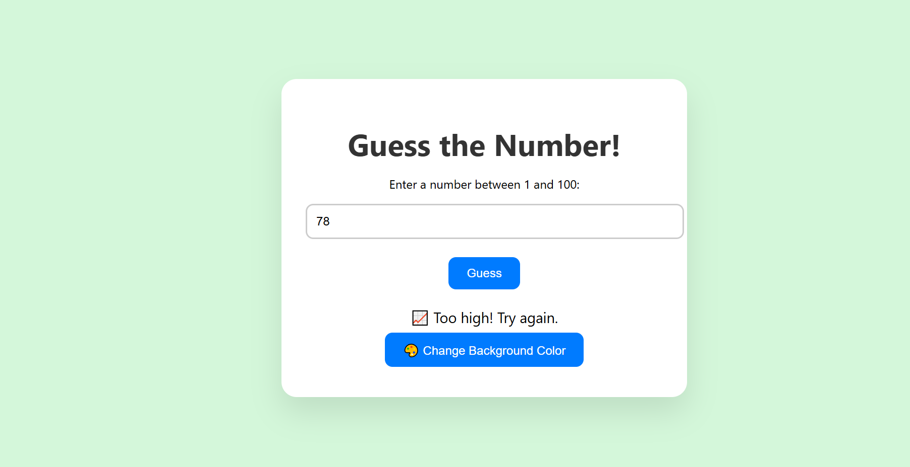
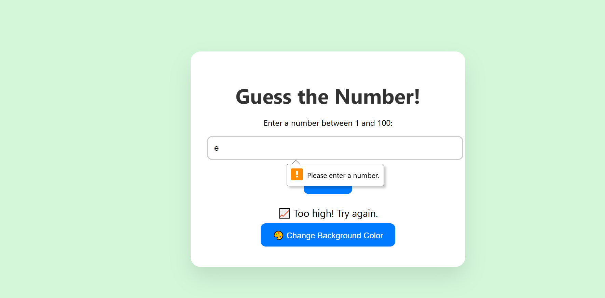
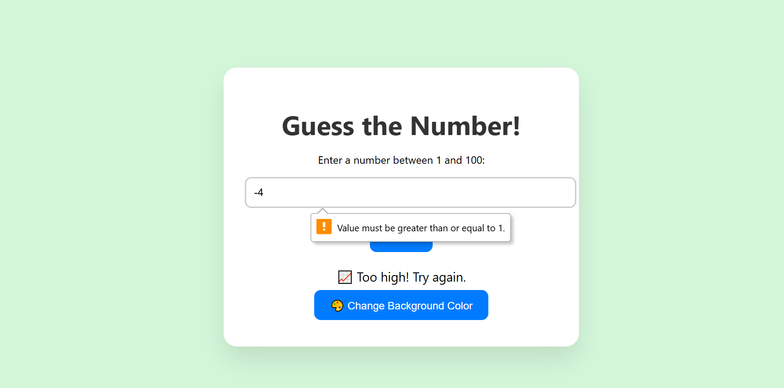
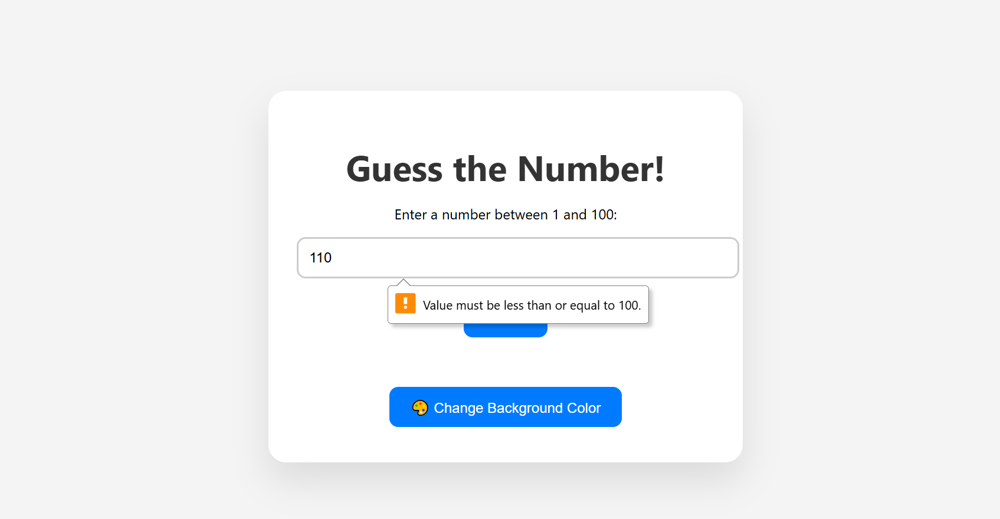

# 🎮 Guess the Number Game

A fun and interactive browser game where the player tries to guess a secret number between 1 and 100. This project showcases core JavaScript concepts and DOM manipulation, along with form validation and interactive elements.

## 🌟 Features

- 🎯 **Random Number Generation**: A secret number is generated each game session.
- 👂 **Event Listeners**: Form submission, color change, and reset buttons are all interactive using JavaScript event listeners.
- 🧠 **Form Validation**: Ensures the user input is a number between 1 and 100.
- 💬 **Dynamic Feedback**: Real-time messages based on user input.
- 🔁 **Play Again Feature**: Allows users to start a new game without reloading the page.
- 🎨 **Interactive Background Color Changer**: Adds a visual twist using JavaScript and HSL color generation.
- 💅 **Modern & Responsive UI**: Clean, mobile-friendly design with stylish CSS.

## 🛠️ Technologies Used

- HTML5
- CSS3 (Flexbox, transitions, responsive design)
- JavaScript (DOM manipulation, event handling, validation)

## 🚀 How to Play

1. Open the project in your browser (`index.html`).
2. Enter a number between 1 and 100 in the input field.
3. Press **Guess** to check your number.
4. Receive instant feedback: too low, too high, or correct!
5. Click **Play Again** to restart the game.
6. Click **🎨 Change Background Color** to randomize the page background.

## 🎓 Learning Objectives Demonstrated

- ✅ **Event Listeners** — used to handle user interactions effectively.
- ✅ **Form Validation** — ensures correct input before processing.
- ✅ **Interactive Elements** — dynamic gameplay and responsive feedback.
- ✅ **Code Separation** — organized into HTML, CSS, and JS for clean structure and scalability.

## 📸 Screenshots

---

Made using HTML, CSS, and JavaScript.
